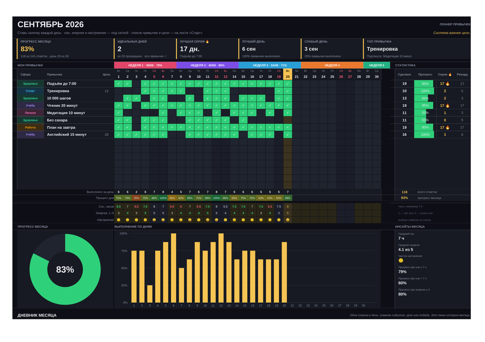

# Планер привычек — Excel-трекер на год

Простой ежедневный трекер привычек в одном файле Excel: человек вписывает свои привычки один раз,
а дальше каждый день ставит галочки. Статистика, серии, лучший день, инсайты и итоги года считаются сами.

| Файл | Что это |
|---|---|
| `Планер привычек.xlsx` | Основной продукт, тёмная тема |
| `Планер привычек (светлая тема).xlsx` | Тот же планер в светлой теме (удобнее печатать) |
| `Планер привычек (пример с данными).xlsx` | Демо: три месяца заполнены, видно, как выглядит живой трекер |
| `build_planner.py` | Генератор всех файлов (см. «Как собрать») |
| `preview/` | Рендеры страниц для README (LibreOffice; в Excel чекбоксы выглядят как настоящие чекбоксы) |



---

## 1. Разбор планеров-конкурентов (по скриншотам из рекламы)

### Планер 1 — @reformyourform (Google Sheets, чёрно-бежевая тема)

**Из чего состоит**

| Блок | Содержимое |
|---|---|
| «Цели на неделю» | 3–5 строк с чекбоксами («тестировать планнер», «запустить продажи», «выполнить все задачи»), кольцевая диаграмма 33 % и счётчики «Всего целей / Выполнено / Не выполнено» |
| KPI-круги | «Выполнено задач 12», «Осталось 2» |
| Недельная сетка | 7 колонок по дням («понедельник 19 мар.» …), в каждой ~13 пустых строк «Запишите задачу здесь» с чекбоксами; выполненное зачёркивается; внизу «Выполнено / Осталось» |
| Под каждым днём | поле «Урок дня», выпадающие списки «Сон» (7 ч), «Энергия» (⚡⚡⚡), «Настроение» (🙂), кольцо «% дня» |
| «Прогресс» | столбчатая диаграмма задач по дням недели (ср … вт), кольцо «Средний %» (25 %), «Лучший день — пт», «Худший день — ср» |
| Лист TRACKREFORM | трекер тренировок: «Всего тренировок 125», «В среднем за день 5», график веса по датам для выбранного упражнения, таблица упражнений (ср. подходы, ср. вес, max, min, всего, чекбокс «Выбрать» для графика) |

**Сильные стороны:** задачи на день пишутся свободно; есть «урок дня» и сон/энергия/настроение;
есть лучший и худший день; отдельный трекер тренировок с выбором упражнения для графика.

**Слабые стороны:** горизонт — одна неделя, привычки приходится вписывать заново каждый день;
нет месячной картины, серий и рекордов; 13 пустых строк на каждый день перегружают экран;
тренировочный лист — отдельный тяжёлый продукт, не связанный с привычками; низкий контраст текста на тёмном фоне.

### Планер 2 — @timeplaners «Трекер привычек (dark blue)» (Google Sheets)

**Из чего состоит**

| Блок | Содержимое |
|---|---|
| Месячная сетка | 31 колонка: строка дней недели + чисел, недели раскрашены («НЕДЕЛЯ 1» красная, 2 — фиолетовая, 3 — синяя, 4 — оранжевая), выпадающий список месяца (Февраль … Май) |
| Привычки по сферам | ЗДОРОВЬЕ («Подъём 6 утра», «🧘 Растяжка 15 мин»), РАБОТА, ЛИЧНОЕ — по 2–3 строки на сферу, чекбокс на каждый день |
| Мотивация | цитата «Цени процесс.» и дата |
| «Еженедельный обзор» | столбчатая диаграмма выполненных по дням (в цвет недели), под ней «выполнено / осталось» по дням, итог недели «35/49 · 71 %» |

**Сильные стороны:** привычки вписываются один раз на месяц; группировка по сферам;
недельные итоги и переключение месяцев; геймификация («ты превратил жизнь в игру»).

**Слабые стороны:** мало строк для привычек (≈7) и они жёстко привязаны к сферам;
нет заметок, сна и настроения; нет серий, лучшего дня, инсайтов; проценты считаются от всего периода,
поэтому в середине месяца прогресс выглядит заниженным; нет годовой картины.

### Сравнение

| Возможность | Планер 1 | Планер 2 | Наш планер |
|---|:-:|:-:|:-:|
| Привычки вписываются один раз | — | месяц | **год** (лист «Старт»), можно переопределить на месяце |
| Горизонт | неделя | месяц | **12 месяцев + лист «Год»** |
| Чекбоксы | Google Sheets | Google Sheets | **нативные чекбоксы Excel 365** (Google Sheets — одним действием) |
| Цель «N дней в месяц» (зал 3×/нед.) | — | — | **есть**, прогресс считается от цели |
| Прогресс относительно прошедших дней | — | — | **есть** — в середине месяца цифры честные |
| Серии подряд 🔥 и рекорд | — | — | **по каждой привычке** |
| Лучший / слабый день | есть | — | **есть** |
| Топ-привычка / что подтянуть | — | — | **есть** |
| Идеальные дни (100 %) | — | — | **есть** |
| Недельные итоги | — | есть | **в полосе недель: 39/56 · 70 %** |
| Сон / энергия / настроение | есть | — | **есть + инсайты** (прогресс при сне ≥ 7 ч и < 7 ч, при энергии ≥ 4) |
| Дневник / урок дня | есть | — | **дневник месяца** (строка на день) |
| Графики | по дням недели, кольца | по дням | **кольцо месяца, столбцы по дням, столбцы по месяцам** |
| Годовые итоги и тепловая карта | — | — | **лист «Год»** |
| Цветные сферы жизни | — | заголовки | **цветные метки у каждой привычки** |
| Тёмная и светлая тема | тёмная | тёмная | **обе** |

---

## 2. Структура нашего планера

### Лист «Старт»
* **Год** — все 12 месяцев подстраиваются под него (даты, дни недели, выходные, «сегодня»).
* **Мои привычки** — до 15 строк: сфера (выпадающий список, цветная метка), название, «цель, дней в месяц»
  (пусто = каждый день), «зачем мне это». Пример уже заполнен — заменяется своими.
* Инструкция «как пользоваться», что считается само, совместимость.

### Листы «Январь» … «Декабрь» (одинаковые)
* **KPI-плитки:** прогресс месяца, идеальных дней, лучшая серия 🔥 (и чья), лучший день, слабый день,
  топ-привычка + «подтянуть».
* **Полоса недель:** «НЕДЕЛЯ 1 · 39/56 · 70 %» — динамически.
* **Сетка «привычки × дни»:** чекбоксы; выходные подсвечены, сегодняшний день выделен, дни вне месяца скрыты.
* **Статистика по привычке:** сделано, прогресс (полоса), серия 🔥, рекорд.
* **Итоги по дням:** выполнено за день, процент дня (тепловая шкала).
* **Сон / энергия / настроение** — по дню; выпадающие списки, цветовые подсказки.
* **Графики:** кольцо прогресса месяца, столбцы «выполнение по дням».
* **Инсайты месяца:** средний сон и энергия, частое настроение, прогресс при сне ≥ 7 ч / < 7 ч, при энергии ≥ 4.
* **Дневник месяца:** одна строка на день, рядом автоматически «6/8 ✓».

### Лист «Год»
* KPI: прогресс года, отметок за год, идеальных дней, лучший месяц, рекорд серии.
* Таблица по месяцам (прогресс, отметки, идеальные дни, серия, сон, энергия), график по месяцам.
* Тепловая карта «привычка × месяц» с итогом за год.

### Как считается
* **Прогресс привычки** = сделано ÷ ожидаемо к сегодняшнему дню. Для ежедневной привычки ожидаемо = прошедших дней;
  для привычки с целью N — N × (прошло дней ÷ дней в месяце). Ограничен 100 %.
* **Прогресс месяца** = среднее прогрессов привычек; **процент дня** = сделано ÷ число привычек.
* **Серия** = дней подряд; незакрытый сегодняшний день серию не ломает. **Рекорд** = лучшая серия месяца.
* **Идеальный день** = все привычки отмечены.

### Совместимость
* **Excel 365** (Windows, Mac, Web, мобильные) — чекбоксы работают сразу.
* **Google Таблицы** — после импорта выделить область галочек → Вставка → Флажок (значения сохраняются).
* **Старые версии Excel / LibreOffice** — вместо галочки ставить `1`, формулы считают так же.

---

## 3. Как собрать

```bash
pip install xlsxwriter openpyxl
python3 build_planner.py --out dist            # три файла в ./dist
python3 build_planner.py --out dist --recalc   # + пересчёт формул в LibreOffice, проверка на ошибки,
                                               #   сверка демо-статистики с независимым расчётом на Python
                                               #   и запись значений в файл (видны даже в превью)
```

Генератор использует только классические функции Excel (`SUMPRODUCT`, `INDEX`/`MATCH`, `EOMONTH`,
`AVERAGEIFS`, `COUNTIF`) — без динамических массивов, чтобы файл работал в любой версии.
При сборке с `--recalc` все 10 026 формул пересчитываются в LibreOffice: ошибок нет,
а значения по демо-данным (счётчики по дням и привычкам, серии, рекорды, идеальные дни) совпадают
с независимым расчётом на Python.
