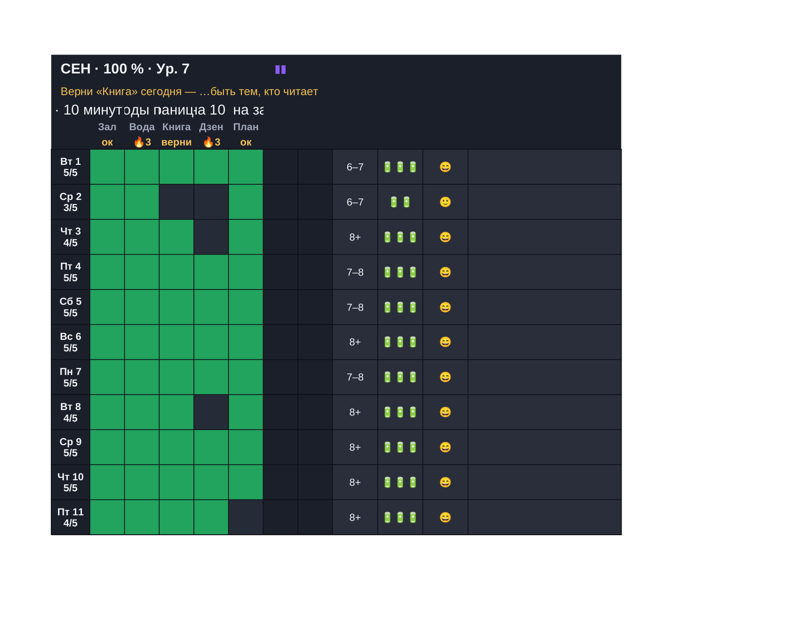

# «Режим» — планер привычек v2

Годовой трекер привычек, который живёт в телефоне. Собран по спецификации совета
(`../council/итог_v2.md`): до семи привычек вписываются один раз, дальше каждый вечер
ставятся галочки в строке сегодняшнего дня. Серии со щитом, честный прогресс, опыт и
уровни, награды, испытание недели и воскресный вопрос считаются формулами — без скриптов.

| Файл | Для чего |
|---|---|
| `Режим · 2026 (тёмный).xlsx` | Основная сборка под Google Таблицы |
| `Режим · 2026 (светлый).xlsx` | Та же сборка в светлой теме (запасная, если тёмная тема приложения мешает) |
| `Режим · демо.xlsx` | Три заполненных месяца: для рилсов и скриншотов |
| `Режим · 2026 · Excel.xlsx` | Бонус для компьютера: нативные флажки Excel 365, полосы вместо SPARKLINE |



## Как выпустить продукт

1. Загрузить `Режим · 2026 (тёмный).xlsx` на Google Диск и открыть как Таблицу (импорт .xlsx).
2. **Включить галочки** — один раз на каждом из 12 листов месяца: выделить сетку
   `B6:H36` → Вставка → Флажок. Смоук-тест показал, что импорт .xlsx не делает флажки сам
   ни при какой проверке данных; всё остальное переживает импорт без правок.
   До этого шага ячейки уже выглядят правильно: пустой квадрат или зелёная плитка,
   потому что текст `TRUE/FALSE` скрыт числовым форматом `;;;` (проверено в Таблицах).
3. Проверить на телефоне: «Старт» открывается первым, сетка помещается без горизонтального
   скролла, плитка текущего месяца подсвечена.
4. Выдать ссылку покупателям в виде `.../edit` → заменить на `/copy`: покупатель делает
   свою копию со всеми флажками и формулами.

## Что проверено

| Проверка | Результат |
|---|---|
| Пересчёт всех формул в LibreOffice | 0 ошибок, 12 609 формул |
| Сверка с эталонной моделью `model.py` | сошлись опыт, серии, щит, возвраты, полные дни, испытания, месячные итоги |
| Бюджеты (раздел 12 спецификации) | ≤5 правил условного форматирования на лист, 12 SPARKLINE, один `TODAY()` |
| Геометрия | кадр 349 px, шапка 124 px, строки 46 px, кегли ≥10 pt |
| Импорт в Google Таблицы | ширины, высоты, заливки, условное форматирование, проверка данных, ссылки-плитки, скрытые листы, эмодзи, SPARKLINE, `CHOOSE` — сохраняются |
| Скрытие `TRUE/FALSE` форматом `;;;` | работает в Таблицах (`preview/проба-галочек-в-таблицах.png`) |
| Флажки из проверки данных | **не** создаются импортом, нужен ручной шаг (см. выше) |

## Устройство

* **`Старт`** — шаги, семь привычек (значок, название, короткое имя, «раз в неделю»),
  блок «Чтобы…», плитки месяцев со ссылками, самопроверка. Ширина кадра 348 px.
* **`Янв` … `Дек`** — шапка 124 px (прогресс и уровень, строка дня, значки, имена, серии),
  сетка «дни × привычки» 46 px на строку, за сгибом сон, силы, настроение и заметка,
  под сеткой список привычек, три цели и блок «Неделя».
* **`Год`** — таблица месяцев с полосами, десять наград, итог года, ответы на вопрос недели.
* **`Обзор`** — зеркало месяца для компьютера через `CHOOSE`, без `INDIRECT`.
* **`Расчёт`** (скрытый) — движок: лента 366 строк, по строке на день года. Зеркала отметок,
  серии со щитом, пропуски месяца, опыт, полные дни, возвраты, блоки месяцев, недель и наград.
* **`Списки`** (скрытый) — значки, пороги уровней, звания.

Механики: прогресс от прошедших дней с учётом «раз в неделю»; серия рвётся вторым пропуском
в месяце (первый закрывает щит); опыт 10 за галочку, 13 с седьмого дня серии, 15 с двадцать
первого и за возвращение, 100 за закрытое испытание; уровни по порогам `100·(L−1)·L`
со званиями Разминка, Разгон, Ритм, Режим.

## Сборка

```bash
pip install xlsxwriter openpyxl
python3 build.py --out ../dist --year 2027            # четыре файла
python3 build.py --out ../dist --demo                 # + демо с данными
python3 build.py --out ../dist --smoke --demo         # пробник на один месяц для импорта
python3 model.py <пересчитанный.xlsx> <демо.json> --year 2026 --today 2026-09-21
```

`build.py` валит сборку, если нарушены бюджеты формул, лимиты текстов или геометрия.
Год фиксируется при сборке: на следующий год файл пересобирается той же командой.
